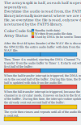

### Software Explanation (Work in progress):

The STM32 utilizes its internal DMAs for fast transfer between internal memory and a peripheral, as well as between the SPI2 peripheral (SD Card) to internal memory. The FATFS library is used to handle the FAT file system of the SD Card.

#### What’s a DMA:

A DMA (Direct Memory Access), to my knowledge, is an internal hardware that handles transfer of data between a peripheral and memory or vice-versa. It runs alongside the main processor sharing the internal data bus. Because the DMA is a separate piece of hardware, it can alleviate the CPU from data transfer, allowing the CPU to do other things (for example, a DMA could send SPI data while the CPU is reading and extracting data from an SD Card).

#### SD Card:

Coming Soon !

#### Audio:

The audio is created by adjusting Timer 1’s duty cycle to the output voltage of the audio. This allows us to feed this varying PWM signal into a low-pass filter, creating a variable voltage dependent on the duty cycle of the PWM. This is similar to how a class-D amplifier operates. While Timer 1 is capable of 16-bit PWMs, because I wanted a relatively high PWM frequency, I only used 8-bits. If the PWM frequency is too low, it won’t have time to reflect the audio’s waveform correctly, resulting in distorted noise. The PWM frequency needs to be at much higher than the song's sample rate for the low pass filter to reflect the changing duty cycle.  

DMA1's channel 7 handles transfer between an internal music buffer and Timer 1's PWM duty cycle. This DMA channel is triggered by Timer 4 in order to send output the audio sample at the right sample rate. The channel has interrupts enabled for half and full transfer (so the DMA will interrupt when half or all the request data is sent). The DMA channel is also set in circular mode, so when it’s done with sending data from the array, it will restart the process by itself.

When the program is initialized, it opens the audio file, then reads the first 44 bytes from the file to remove the WAV header file (it can used to automatically set the sample rate, but I didn’t implement it in this program and am assuming a 40Khz sample rate). Then, the entire audio buffer is filled with audio content. Because a WAV file is essentially the output voltage for each sample, the data from a WAV file can be directly fed into Timer 1's ** register. An internal variable (music_bufferCount) is also stored to determine which half of the buffer is to be updated from the audio file, and is set to 1 during the program's initialization (so that the interrupt routine thinks that we have just read the second half of the music buffer's array, so it updates the first half of the buffer when it gets triggered for the first time).

After all other initializations, Timer 4 is enabled, starting the DMA transfer on Channel 7. Every time Timer4 is triggered, the DMA sends a byte from the audio buffer to Timer 1’s ** register.  When either a half or full transfer is completed, the DMA triggers an interrupt routine. During this interrupt routing, half of the audio buffer’s size is read from the SD Card and written into either the first half or second half of the buffer, depending on the value of music_bufferCount. When the program is initialized, this variable is set to 0. When the DMA triggers the interrupt routine for the first time(so it’s a half-transfer interrupt and the first half of the buffer has been sent out), the first half of the audio buffer is updated with new audio content. When the DMA’s interrupt triggers the next time (for a full transfer this time, as it has sent out the second half of the audio buffer), the second half of the audio buffer is updated with new content. Because the DMA channel is set in circular mode, after it interrupts for a full transfer, the updated first half of the buffer is sent out. This results in a continuous loop where one half of the audio buffer is updated while the other half is being sent out to Timer 1. This allows us to not store the entire audio file internally, which the STM32 doesn’t have memory to do anyways. The end-of-file is detected by comparing the expected number of bytes to be received and the number of bytes returned by the FATFS library. In this case, it will disable the interrupt, set the DMA to normal mode instead of circular mode, set a variable called last_music_file_size to the number of bytes read by the FATFS library, and will set a flag (called end_of_music_file) to true. In the main program, there is an infinite while loop (equivalent to "void loop" in an Arduino environment). Inside this loop, the flag is checked is checked if it's set to true. If it is and the DMA's half or full status flags are triggered, that means we still have one last chunk of data to be sent out (because the interrupt routine reads data from the file before checking if it's the end of the file). So it restarts the DMA, adjusting the number of data to be sent to last_music_file_size. After, if the DMA's half or full status flags are interrupted again, that means the last chunk of data has been sent out by the DMA, and it's time to disable it, as well as disable Timer 1 and Timer 4.

I have included a graphic demonstrating how the DMA and the interrupt routine interacts with the audio buffer:

#### Video:

The video, which is displayed on an SSD1351 OLED module, is stored as .hex file consisting of the raw pixel values (in sets of 2 bytes). This allows us to use the DMA for a direct transfer between the SD card's content and the display without any extra computation (just like how the audio was handled). Depending on the define IS_WIDE_VIDEO found in main.h, the device can either handle 128x72 or 128x96 frames(a 4:3 or a 16:9 aspect ratio video). The generation of the custom .hex file will be talked about in the "Python Program" section.

DMA1's channel 3 handles transfer between an internal video buffer and the display (thru SPI1). The DMA is trigged by the SPI module it's writing to, so it will send out data to the display as soon as it's able to. The buffer in this case is a 2 dimentional buffer of size 2 x VID_BUFFER_SIZE (where VID_BUFFER_SIZE is defined as 128x72x2 or 128x96x2, depending on the IS_WIDE_VIDEO flag). The DMA only has it's full transfer interupt enabled, and it's set up in non-ciruclar mode (so the DMA will stop once it has sent out all of it's data). Timer 3 is a timer set to 25FPS (will make it dynamic to the video soon). This is to control the rate at which we send out data to the display.

The reason for not having it be in circular mode like the audio DMA is because I had ciculation issues with the video DMA, where it will circle back to the orginal data before the interupt has a chance to update it. It also leads to complications, as the interupt routine, when a single frame of data is sent out, will wait until Timer 3 is set.

When the program is initialized, it opens the video file and initializes the DMA and Timer 3. The entirely of vid_buffer is filled with data from the SD Card, just like the audio buffer was. The variable video_bufferCount is set to 1 (for the same reason as for music_bufferCount), and the variable vid_number_of_send set to VID_HALF_BUFFER_SIZE/2, which will keep track of how much pixels we have sent out (each pixel has 2 bytes of data). Then, Timer 3 and the DMA is started.

The DMA interupt routine is the same as the audio's interrupt routine in function, except it's dealing with a 2-dimention array intead of a single dimention array. This routine is also differs as it check if vid_number_of_send is the same size or greater then a frame's pixel count (vid_number_of_send is incremented by (VID_HALF_BUFFER_SIZE/2) per interupt trigger). If that's the case, it waits for Timer 3 to finish counting, meaning 1/25th of a second has passed. After, it resets timer 3 and some variables and re-sends the display data send command. This ensures that we have a constant frame-per-second on the display. When the end-of-file has been reached, the same process as the audio part of the program occurs to the video process (ending the DMA, sending 1 more data chuck after the DMA is done, and disabling the DMA after all data is sent out).

#### Python Program

Coming Soon !
